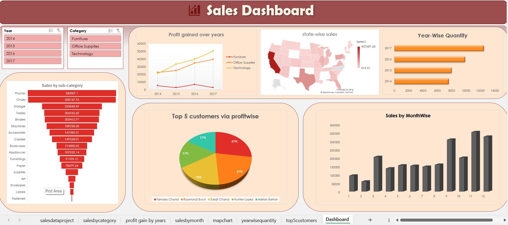

# 📊 Retail Sales Analytics Dashboard (Excel)

An interactive **Business Intelligence dashboard** built using **Microsoft Excel** to analyze retail sales performance across categories, regions, customers, and time periods.  
This project transforms raw transactional data into **actionable insights** through dynamic visualizations and data-driven analysis.

---

## 🚀 Project Overview

In modern retail, data analytics plays a crucial role in understanding market trends, optimizing inventory, and improving profitability.  
This dashboard provides a comprehensive analysis of:

- Category-wise sales performance  
- Year-wise profit trends  
- Monthly seasonal sales patterns  
- State-wise regional sales distribution  
- Top profitable customers  
- Yearly quantity growth  

The dashboard enables stakeholders such as **business managers, analysts, and marketers** to make informed strategic decisions.

---

## 📂 Dataset

**Sample Superstore Dataset (Public Dataset)**  
https://community.tableau.com/s/question/0D54T00000CWeX8SAL/sample-superstore-sales-excelxls

---

## 🛠️ Tools & Technologies

- Microsoft Excel  
- Pivot Tables & Pivot Charts  
- Power Query (Data Cleaning)  
- Map Charts  
- Funnel Charts  
- Column & Line Charts  
- Pie Charts  
- Slicers (Interactive Filters)  
- Conditional Formatting  

---

## 🔄 Data Preprocessing

The dataset was cleaned and structured to ensure accurate analysis:

- Date field decomposed into **Year and Month**  
- Missing and inconsistent values handled  
- Category labels standardized  
- Numeric fields normalized (**Sales, Profit, Quantity**)  
- Transactional data structured for pivot-based modeling  

---

## 📈 Dashboard Analysis

### Category-Wise Total Sales  
Identifies high-performing product categories.  
**Visualization:** Funnel Chart  

### Year-Wise Profit by Category  
Analyzes profitability trends over time.  
**Visualization:** Line Chart  

### Month-Wise Sales Trend  
Detects seasonal demand patterns.  
**Visualization:** Column Chart  

### State-Wise Sales Distribution  
Provides geographic performance insights.  
**Visualization:** Map Chart  

### Year-Wise Quantity Sold  
Tracks growth in product demand volume.  
**Visualization:** Horizontal Bar Chart  

### Top 5 Customers by Profit  
Highlights most valuable customers.  
**Visualization:** Pie Chart  

---

## 🎯 Key Insights

- Technology and Office Supplies generate the highest sales  
- Seasonal demand patterns observed across months  
- Certain states contribute significantly to revenue  
- A small group of customers drives major profit share  
- Increasing yearly quantity indicates growing market demand  

---

## 🔮 Future Scope

- Real-time data integration  
- Customer segmentation analysis  
- Predictive analytics using Machine Learning  
- Advanced drill-down features  
- Profitability heatmaps  
- Inventory optimization insights  

---

## 📸 Dashboard Preview

*(Add dashboard screenshot here)*  

Example:  
```

```

---

## 👩‍💻 Author

**Neha**  
B.Tech Computer Science  
Lovely Professional University  

---

⭐ If you found this project useful, consider giving it a star.
